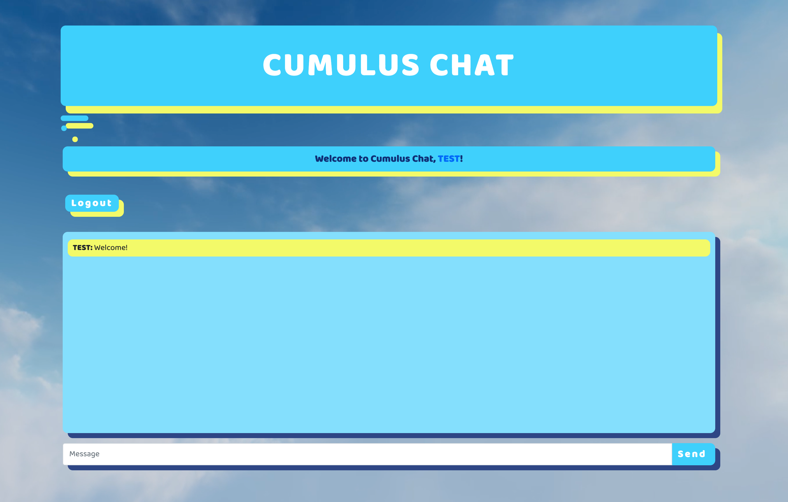

## CUMULUS CHAT
 
 

## Description
Hello, welcome to the Cumulus Chat app Github page. We created this chat app because we believe staying connected with friends is essential. The app is built using Node, Express, Sequelize, MySQL, Bootstrap, Handlebars, and Socket.io.
## Deploy link
https://infinite-caverns-73704.herokuapp.com/
## Table of Contents 
* [Installation](#installation)
* [Usage](#usage)
* [License](#license)
* [Collaborators](#collaborators)
* [Credits](#credits)
* [Screenshot](#screenshot)
* [Questions](#questions)
## Installation
The following steps must be completed if application is pulled from GitHub rather than the deploy link. User must first clone the repo, open up intergrated terminal in VS Code, npm i to install all dependencies, set up personal My SQL and source the schema. sql file, npm run seed, and lastly npm start to run the server on you local machine.
# Usage
This application is used for a real-time communication between users. 
# License
This project is license under the MIT license.
## Collaborators 
Elizabeth R. (Eli-coding) | Michael B. (mbarrienos1129)| Bowen Zheng (bxz5089)| Genevie Giko (Geneviealba)

## Credits

- https://www.youtube.com/watch?v=jD7FnbI76Hg&ab_channel=TraversyMedia
- https://www.youtube.com/watch?v=jD7FnbI76Hg&t=403s
- https://github.com/WebDevSimplified/Realtime-Simple-Chat-App/blob/master/script.js
- https://www.youtube.com/watch?v=rxzOqP9YwmM
- https://codepen.io/kirstenallen/pen/MWwPYYm
- https://www.bootdey.com/snippets/view/chat-app
- https://elements.envato.com/seamless-loop-of-clouds-storm-clouds-and-blue-sky--LUX5JGE

# Sreenshot 

# Questions
If you have any questions about the repo or an issue you can contact us directly by email.
bxz5089@gmail.com |  elizabethyoannnie2020@gmail.com | michael.barrientos@gmail.com | sunnydayvirtual@gmail.com
